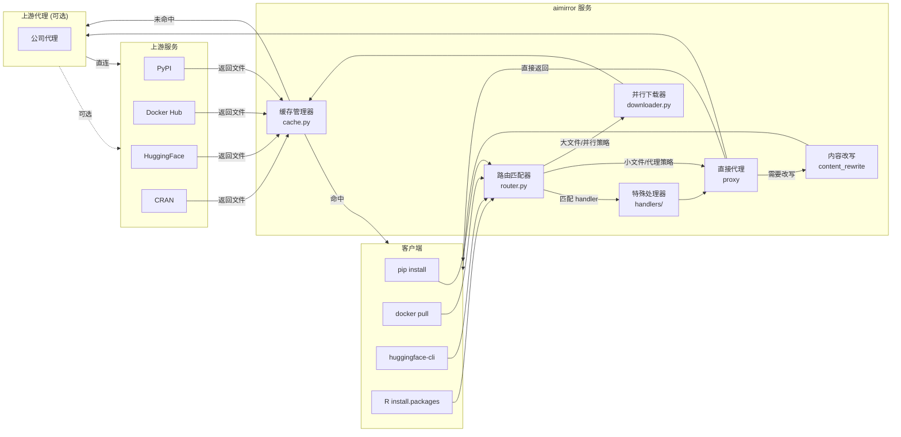

# 🚀 aimirror

[](https://www.python.org/)
[](https://fastapi.tiangolo.com/)
[](LICENSE)
[](https://pypi.org/project/aimirror/)

> AI 时代的下载镜像加速器 —— 被慢速网络逼疯的工程师的自救工具
> 
> **一个服务 = PyPI + Docker Hub + CRAN + HuggingFace 全加速，还能任意扩展更多源**

## 💡 项目背景

作为一名 AI 工程师，每天的工作离不开：
- `pip install torch` —— 几百 MB 的 wheel 包下载到地老天荒
- `docker pull nvidia/cuda` —— 几个 GB 的镜像层反复下载
- `huggingface-cli download` —— 模型文件从 HuggingFace 蜗牛般爬过来

公司内网有代理，但单线程下载大文件依然慢得让人崩溃。重复下载相同的包？不存在的缓存。忍无可忍，于是写了这个工具。

**aimirror** = 智能路由 + 并行分片下载 + 本地缓存，让下载速度飞起来。

## ✨ 功能特性

- **⚡ 并行下载** —— HTTP Range 分片，多线程并发，榨干带宽
- **💾 智能缓存** —— 基于文件 digest 去重，LRU 自动淘汰
- **🎯 动态路由** —— 小文件直接代理，大文件自动并行
- **🔗 多源支持** —— Docker Hub、PyPI、CRAN、HuggingFace 开箱即用
- **🔌 任意扩展** —— 只要是 HTTP 下载，配置一条规则即可几十倍加速
- **📝 内容改写** —— 自动改写 HTML/JSON 响应中的链接，无缝代理
- **🎛️ 特殊处理** —— 支持自定义 Handler 处理复杂场景（如 Docker Registry）
- **🚦 并发控制** —— 全局下载并发限制，防止资源耗尽
- **🔄 路径重写** —— 灵活的路径替换规则，适配各种 API 差异
- **🔑 缓存优化** —— 支持原始 URL 作为缓存 key，解决临时签名问题

## 🔥 性能实测

### PyPI 包安装加速对比

使用 `uv pip install` 安装 148 个依赖包（含 torch、transformers 等大包）：

| 模式 | 解析依赖 | 准备包 | 总耗时 | 加速比 |
|------|---------|--------|--------|--------|
| ❌ 仅代理 (900KB/s) | 17m 04s | 14m 20s | **~31 分钟** | 1x |
| ✅ aimirror (170MB/s) | 34.78s | 45.81s | **~80 秒** | **23x** |

> 💡 **实测环境**: 公司内网代理，带宽瓶颈明显。使用 aimirror 后从 900KB/s 飙升至 170MB/s，**提速近 200 倍**！

### 缓存效果

| 场景 | 耗时 | 速度 | 说明 |
|------|------|------|------|
| 首次下载 | 80s | 170MB/s | 并行下载 + 写入缓存 |
| 缓存命中 | <1s | **3000+ MB/s** | 万兆内网实测，本地 SSD 更快，瞬开 |

### 多源同时加速

**一个 aimirror 服务，同时加速多种包管理器：**

| 包管理器 | 配置方式 | 加速效果 |
|---------|---------|---------|
| **pip/uv** | `export HTTPS_PROXY=http://localhost:8081` 或 `pip install -i http://localhost:8081/simple` | PyPI 包 23x 加速 |
| **docker** | `/etc/docker/daemon.json` 中设置 `registry-mirrors` | 镜像拉取并行分片 |
| **R CRAN** | `options(repos = c(CRAN = "http://localhost:8081"))` | R 包下载加速 |
| **huggingface-cli** | `export HF_ENDPOINT=http://localhost:8081` | 模型文件秒下 |
| **conda** | `.condarc` 中配置 `channels` | 同理可扩展 |
| **npm/maven** | 配置 registry 指向 aimirror | 任意 HTTP 源均可 |

> 🔌 **扩展能力**: 只要是 HTTP 下载，在 `config.yaml` 中添加一条规则即可接入加速，无需启动多个服务。

## 🏗️ 架构



## 🚀 快速开始

### 方式一：pip 安装（推荐）

```bash
# 安装
pip install aimirror

# 启动
aimirror

# 使用
curl http://localhost:8081/health
```

### 方式二：源码安装

```bash
# 克隆仓库
git clone https://github.com/livehl/aimirror.git
cd aimirror

# 安装依赖
pip install -r requirements.txt

# 启动
python main.py

# 使用
curl http://localhost:8081/health
```

## 🔧 客户端配置

### pip / uv

```bash
# 临时使用（单次安装）
pip install torch --index-url http://localhost:8081/simple --trusted-host localhost:8081

# 全局配置（推荐）
pip config set global.index-url http://localhost:8081/simple
pip config set global.trusted-host localhost:8081

# 使用 uv（速度更快）
uv pip install torch --index-url http://localhost:8081/simple

# 或使用环境变量
export HTTPS_PROXY=http://localhost:8081
pip install torch
```

### Docker

```bash
# 配置 daemon.json
sudo tee /etc/docker/daemon.json <<EOF
{
  "registry-mirrors": ["http://localhost:8081"]
}
EOF
sudo systemctl restart docker

# 或临时拉取
docker pull --registry-mirror=http://localhost:8081 nginx
```

> **⚠️ 重要提示**：Docker 镜像层文件通常很大（GB 级别），建议将 `chunk_size` 设置为 `0`（自动模式）。
> 
> 自动模式下，`chunk_size = 文件总大小 / concurrency`，这样可以：
> - 避免固定小分片导致分片数量过多
> - 减少 Docker Registry token 因超时失效的概率
> - 保持并发数不变，同时优化分片大小
>
> 配置示例见 `config.yaml` 中的 `docker-blob` 规则。

### HuggingFace (huggingface-cli)

```bash
# 设置环境变量
export HF_ENDPOINT=http://localhost:8081

# 下载模型（支持所有文件类型：.gguf, .bin, .safetensors, .json 等）
huggingface-cli download TheBloke/Llama-2-7B-GGUF llama-2-7b.Q4_K_M.gguf

# 下载整个仓库
huggingface-cli download meta-llama/Llama-2-7b-hf --local-dir ./models
```

或使用 Python:
```python
import os
os.environ["HF_ENDPOINT"] = "http://localhost:8081"

from huggingface_hub import hf_hub_download, snapshot_download

# 下载单个文件
hf_hub_download(repo_id="TheBloke/Llama-2-7B-GGUF", filename="llama-2-7b.Q4_K_M.gguf")

# 下载整个仓库
snapshot_download(repo_id="meta-llama/Llama-2-7b-hf", local_dir="./models")
```

### R (CRAN)

```r
# 在 R 控制台中设置
options(repos = c(CRAN = "http://localhost:8081"))

# 或在 .Rprofile 中永久配置
cat('options(repos = c(CRAN = "http://localhost:8081"))\n', file = "~/.Rprofile")
```

### Conda

```bash
# 修改 .condarc
cat >> ~/.condarc <<EOF
channels:
  - http://localhost:8081/conda-forge
  - http://localhost:8081/bioconda
EOF
```

### npm / yarn

```bash
# 临时使用
npm install --registry http://localhost:8081/registry/npm

# 全局配置
npm config set registry http://localhost:8081/registry/npm
yarn config set registry http://localhost:8081/registry/npm
```

## 📖 API

### 代理端点

| 路径 | 方法 | 说明 |
|------|------|------|
| `/{full_path:path}` | GET/HEAD/POST/PUT/DELETE | 通用代理入口，根据路由规则转发到对应上游 |

### 管理端点

| 路径 | 方法 | 说明 | 响应示例 |
|------|------|------|----------|
| `/health` | GET | 健康检查 | `{"status": "ok", "active_downloads": 0, "downloads": []}` |
| `/stats` | GET | 缓存统计信息 | `{"cache": {"total_size_mb": 1024, "file_count": 100}}` |

### 健康检查响应详情

```bash
curl http://localhost:8081/health
```

响应字段说明：
- `status`: 服务状态，`ok` 表示正常运行
- `active_downloads`: 当前正在进行的下载任务数
- `downloads`: 正在下载的文件列表（缓存 key）

### 缓存统计响应详情

```bash
curl http://localhost:8081/stats | jq
```

响应包含缓存目录的总大小、文件数量等信息。

## 🚀 快速开始

### 方式一：pip 安装（推荐）

```bash
# 安装
pip install aimirror

# 启动
aimirror

# 使用
curl http://localhost:8081/health
```

### 方式二：源码安装

```bash
# 克隆仓库
git clone https://github.com/livehl/aimirror.git
cd aimirror

# 安装依赖
pip install -r requirements.txt

# 启动
python main.py

# 使用
curl http://localhost:8081/health
```

## 🐳 Docker 部署

### 使用 GitHub Container Registry

```bash
# 拉取镜像
docker pull ghcr.io/livehl/aimirror:latest

# 运行（基础版）
docker run -d -p 8081:8081 \
  -v $(pwd)/cache:/data/fast_proxy/cache \
  ghcr.io/livehl/aimirror:latest

# 运行（带自定义配置）
docker run -d -p 8081:8081 \
  -v $(pwd)/config.yaml:/app/config.yaml \
  -v $(pwd)/cache:/data/fast_proxy/cache \
  ghcr.io/livehl/aimirror:latest
```

### Docker Compose 示例

```yaml
version: '3.8'

services:
  aimirror:
    image: ghcr.io/livehl/aimirror:latest
    container_name: aimirror
    ports:
      - "8081:8081"
    volumes:
      - ./config.yaml:/app/config.yaml
      - ./cache:/data/fast_proxy/cache
      - ./logs:/data/fast_proxy
    restart: unless-stopped
```

> **注意**：上游代理请在 `config.yaml` 中配置 `server.upstream_proxy`，不支持环境变量方式。

## ⚙️ 配置示例

```yaml
# fast_proxy 配置文件
server:
  host: "0.0.0.0"
  port: 8081
  upstream_proxy: ""  # 上游代理，默认空表示直连
  public_host: "127.0.0.1:8081"  # 对外访问地址，用于 HTML 链接改写
  max_concurrent_downloads: 100  # 全局最大并发下载数，超过则排队

cache:
  dir: "/data/fast_proxy/cache"
  max_size_gb: 100
  lru_enabled: true

rules:
  # Docker Registry 代理（/v2/ 和 /v2/auth 在代码中特殊处理）
  - name: docker-blob
    pattern: "/v2/.*/blobs/sha256:[a-f0-9]+"
    upstream: "https://registry-1.docker.io"
    strategy: parallel
    min_size: 1       # all
    concurrency: 20
    chunk_size: 0     # 自动模式：总大小/concurrency，避免超大文件分片过多导致 token 超时
  - name: docker-registry
    pattern: "/v2/.*"
    upstream: "https://registry-1.docker.io"
    strategy: proxy
    handler: handlers.docker  # 特殊处理模块路径
    
  - name: pip-packages
    pattern: "/packages/.+\\.(whl|tar\\.gz|zip)$"
    upstream: "https://pypi.org"
    strategy: parallel
    min_size: 1       # all
    concurrency: 20
    chunk_size: 5242880      # 5MB per chunk
    
  - name: r-package
    pattern: "/src/contrib/.*"
    upstream: "https://cran.r-project.org"
    strategy: parallel
    min_size: 102400       # 100K
    concurrency: 20
    chunk_size: 5242880

  - name: huggingface-files
    pattern: '/.*/(blob|resolve)/[^/]+/.+'
    upstream: "https://huggingface.co"
    strategy: parallel
    min_size: 102400       #100k
    concurrency: 20
    chunk_size: 10485760    # 10MB per chunk
    cache_key_source: original  # 使用原始 URL 作为缓存 key（避免临时签名影响缓存命中）
    path_rewrite:
      - search: "/blob/"
        replace: "/resolve/"
    # HEAD 请求时需要额外保留的响应头（用于元数据获取）
    head_meta_headers:
      - "x-repo-commit"
      - "x-linked-etag"
      - "x-linked-size"
      - "etag"

  - name: huggingface-api
    pattern: '/api/models/.*'
    upstream: "https://huggingface.co"
    strategy: proxy

  # 示例：其他使用临时签名 URL 的站点
  # - name: example-signed-url
  #   pattern: '/signed-download/.*'
  #   upstream: "https://example.com"
  #   strategy: parallel
  #   min_size: 10485760
  #   concurrency: 10
  #   cache_key_source: original  # 使用原始 URL 作为缓存 key

  - name: default
    pattern: ".*"
    upstream: "https://pypi.org"
    strategy: proxy
    content_rewrite:         # 响应内容改写配置
      content_types:         # 匹配的 Content-Type（HTML 和 JSON）
        - "text/html"
        - "application/json"
        - "application/vnd.pypi.simple"
      targets:               # 要替换的目标 host 列表
        - "https://files.pythonhosted.org"

logging:
  level: "INFO"
  file: "/data/fast_proxy/fast_proxy.log"
```

### 配置说明

#### Server 配置

| 字段 | 说明 | 默认值 |
|------|------|--------|
| `server.host` | 服务监听地址 | `"0.0.0.0"` |
| `server.port` | 服务监听端口 | `8081` |
| `server.upstream_proxy` | 上游代理地址，空字符串表示直连 | `""` |
| `server.public_host` | 对外访问地址，用于 HTML 链接改写 | `"127.0.0.1:8081"` |
| `server.max_concurrent_downloads` | 全局最大并发下载数，超过则排队 | `100` |

#### Cache 配置

| 字段 | 说明 | 默认值 |
|------|------|--------|
| `cache.dir` | 缓存目录路径 | `"./cache"` |
| `cache.max_size_gb` | 缓存最大容量（GB） | `100` |
| `cache.lru_enabled` | 是否启用 LRU 自动淘汰 | `true` |

#### Rules 配置

| 字段 | 说明 | 示例 |
|------|------|------|
| `rules[].name` | 规则名称 | `"docker-blob"` |
| `rules[].pattern` | URL 匹配正则表达式 | `"/v2/.*/blobs/sha256:[a-f0-9]+"` |
| `rules[].upstream` | 上游源 base URL | `"https://registry-1.docker.io"` |
| `rules[].strategy` | 下载策略：`proxy` 直接代理 / `parallel` 并行下载 | `"parallel"` |
| `rules[].min_size` | 最小文件大小（字节），小于此值使用代理 | `1048576` |
| `rules[].concurrency` | 并行下载线程数 | `20` |
| `rules[].chunk_size` | 每个分片大小（字节），**≤0 表示自动计算**（总大小/concurrency） | `10485760` |
| `rules[].cache_key_source` | 缓存 key 来源：`original` 使用原始URL，`final` 使用最终URL | `"original"` |
| `rules[].path_rewrite` | 路径重写规则数组 | `[{search: "/blob/", replace: "/resolve/"}]` |
| `rules[].content_rewrite` | 响应内容改写配置（用于 HTML/JSON 中的链接替换） | 见 default 规则 |
| `rules[].handler` | 特殊处理模块路径 | `"handlers.docker"` |
| `rules[].head_meta_headers` | HEAD 请求时额外保留的响应头列表 | `["etag", "x-repo-commit"]` |

#### Logging 配置

| 字段 | 说明 | 默认值 |
|------|------|--------|
| `logging.level` | 日志级别：`DEBUG`/`INFO`/`WARNING`/`ERROR` | `"INFO"` |
| `logging.file` | 日志文件路径 | `"/tmp/fast_proxy.log"` |

### 高级配置示例

#### 自定义 Handler

创建 `handlers/custom.py`：

```python
async def exec_path(request, full_path, config, http_client):
    """
    自定义请求处理器
    
    Args:
        request: FastAPI Request 对象
        full_path: 请求路径
        config: 全局配置字典
        http_client: httpx.AsyncClient 实例
    
    Returns:
        (handled, response): 
        - handled: bool，是否已处理
        - response: 如果 handled=True，返回 Response 对象
    """
    if full_path.startswith('/custom/'):
        # 处理自定义逻辑
        return True, Response(content="Custom response")
    
    # 未处理，继续后续流程
    return False, None
```

在 `config.yaml` 中配置：

```yaml
rules:
  - name: custom-handler
    pattern: "/custom/.*"
    upstream: "https://example.com"
    strategy: proxy
    handler: handlers.custom
```

#### 扩展示例：添加 GitHub Releases 下载加速

```yaml
rules:
  - name: github-releases
    pattern: '/.*/releases/download/.+'
    upstream: "https://github.com"
    strategy: parallel
    min_size: 1048576      # 1MB 以上启用并行
    concurrency: 16
    chunk_size: 10485760   # 10MB 分片
```

#### 扩展示例：添加自定义软件源

```yaml
rules:
  - name: my-company-repo
    pattern: '/artifacts/.+\.(jar|war|zip)$'
    upstream: "https://artifacts.mycompany.com"
    strategy: parallel
    min_size: 10485760     # 10MB 以上启用并行
    concurrency: 10
    chunk_size: 20971520   # 20MB 分片
    cache_key_source: original
```

## 🧪 测试

### 运行测试

```bash
# 运行简单测试（无需 pytest）
python test_simple.py

# 运行完整测试套件（需要 pytest）
pytest test_proxy.py -v
```

### 手动验证

**测试 PyPI 代理**
```bash
curl -o /dev/null "http://localhost:8081/packages/fb/d7/71b982339efc4fff3c622c6fefecddfd3e0b35b60c5f822872d5b806bb71/torch-1.0.0-cp27-cp27m-manylinux1_x86_64.whl" \
  -w "HTTP: %{http_code}, Size: %{size_download}, Time: %{time_total}s\n"
```

**测试 HuggingFace 代理**
```bash
export HF_ENDPOINT=http://localhost:8081

# 测试下载 GGUF 模型文件
huggingface-cli download TheBloke/Llama-2-7B-GGUF llama-2-7b.Q4_K_M.gguf

# 测试下载 safetensors 格式模型
huggingface-cli download meta-llama/Llama-2-7b-hf model-00001-of-00002.safetensors

# 测试下载整个仓库
huggingface-cli download sentence-transformers/all-MiniLM-L6-v2 --local-dir ./test-model
```

**测试 Docker Registry 代理**
```bash
# 获取 token
TOKEN=$(curl -s "https://auth.docker.io/token?service=registry.docker.io&scope=repository:library/nginx:pull" \
  | grep -o '"token":"[^"]*"' | cut -d'"' -f4)

# 下载 blob
curl -o /dev/null "http://localhost:8081/v2/library/nginx/blobs/sha256:abc123" \
  -H "Authorization: Bearer $TOKEN" \
  -w "HTTP: %{http_code}, Size: %{size_download}, Time: %{time_total}s\n"
```

**验证缓存命中**
```bash
# 第一次下载（并行下载）
time curl -o /tmp/test1.gguf "http://localhost:8081/unsloth/model/resolve/main/file.gguf"

# 第二次下载（缓存命中，应该快很多）
time curl -o /tmp/test2.gguf "http://localhost:8081/unsloth/model/resolve/main/file.gguf"

# 查看缓存统计
curl http://localhost:8081/stats | jq
```

## 📄 License

MIT