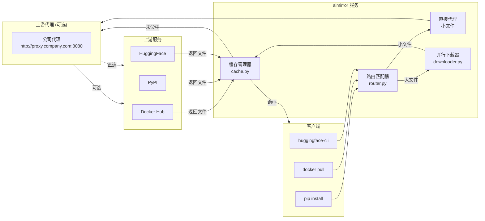

# 🚀 aimirror

[](https://www.python.org/)
[](https://fastapi.tiangolo.com/)
[](LICENSE)
[](https://pypi.org/project/aimirror/)

> AI 时代的下载镜像加速器 —— 被慢速网络逼疯的工程师的自救工具

## 💡 项目背景

作为一名 AI 工程师，每天的工作离不开：
- `pip install torch` —— 几百 MB 的 wheel 包下载到地老天荒
- `docker pull nvidia/cuda` —— 几个 GB 的镜像层反复下载
- `huggingface-cli download` —— 模型文件从 HuggingFace 蜗牛般爬过来

公司内网有代理，但单线程下载大文件依然慢得让人崩溃。重复下载相同的包？不存在的缓存。忍无可忍，于是写了这个工具。

**aimirror** = 智能路由 + 并行分片下载 + 本地缓存，让下载速度飞起来。

## ✨ 功能特性

- **⚡ 并行下载** —— HTTP Range 分片，多线程并发，榨干带宽
- **💾 智能缓存** —— 基于文件 digest 去重，LRU 自动淘汰
- **🎯 动态路由** —— 小文件直接代理，大文件自动并行
- **🔗 多源支持** —— Docker Hub、PyPI、CRAN、HuggingFace 开箱即用
- **🔌 任意扩展** —— 只要是 HTTP 下载，配置一条规则即可几十倍加速

## 🏗️ 架构



## 🚀 快速开始

### 方式一：pip 安装（推荐）

```bash
# 安装
pip install aimirror

# 启动
aimirror

# 使用
curl http://localhost:8081/health
```

### 方式二：源码安装

```bash
# 克隆仓库
git clone https://github.com/livehl/aimirror.git
cd aimirror

# 安装依赖
pip install -r requirements.txt

# 启动
python main.py

# 使用
curl http://localhost:8081/health
```

## 🔧 客户端配置

**pip**
```bash
pip install torch --index-url http://localhost:8081/simple --trusted-host localhost:8081
```

**Docker**
```json
{
  "registry-mirrors": ["http://localhost:8081"]
}
```

**HuggingFace (huggingface-cli)**
```bash
# 设置环境变量
export HF_ENDPOINT=http://localhost:8081

# 下载模型（支持所有文件类型：.gguf, .bin, .safetensors, .json 等）
huggingface-cli download TheBloke/Llama-2-7B-GGUF llama-2-7b.Q4_K_M.gguf

# 下载整个仓库
huggingface-cli download meta-llama/Llama-2-7b-hf --local-dir ./models
```

或使用 Python:
```python
import os
os.environ["HF_ENDPOINT"] = "http://localhost:8081"

from huggingface_hub import hf_hub_download, snapshot_download

# 下载单个文件
hf_hub_download(repo_id="TheBloke/Llama-2-7B-GGUF", filename="llama-2-7b.Q4_K_M.gguf")

# 下载整个仓库
snapshot_download(repo_id="meta-llama/Llama-2-7b-hf", local_dir="./models")
```

## 📖 API

| 路径 | 说明 |
|------|------|
| `/*` | 代理到对应上游 (Docker/PyPI/CRAN/HuggingFace) |
| `/health` | 健康检查 |
| `/stats` | 缓存统计 |

## 🐳 Docker 部署

```bash
# 使用 PyPI 安装（推荐）
pip install aimirror
aimirror

# 或使用 GitHub Container Registry
docker pull ghcr.io/livehl/aimirror:latest

# 运行（基础版）
docker run -d -p 8081:8081 -v $(pwd)/cache:/data/fast_proxy/cache ghcr.io/livehl/aimirror:latest

# 运行（带自定义配置）
docker run -d -p 8081:8081 \
  -v $(pwd)/config.yaml:/app/config.yaml \
  -v $(pwd)/cache:/data/fast_proxy/cache \
  ghcr.io/livehl/aimirror:latest
```

## ⚙️ 配置示例

```yaml
server:
  host: "0.0.0.0"
  port: 8081
  upstream_proxy: "http://proxy.company.com:8080"  # 公司代理（可选）

cache:
  dir: "./cache"
  max_size_gb: 100

rules:
  - name: docker-blob
    pattern: "/v2/.*/blobs/sha256:[a-f0-9]+"
    upstream: "https://registry-1.docker.io"
    strategy: parallel
    min_size: 1048576
    concurrency: 20
    chunk_size: 10485760

  - name: pip-wheel
    pattern: "/packages/.+\.whl$"
    upstream: "https://pypi.org"
    strategy: parallel
    min_size: 1048576
    concurrency: 20
    chunk_size: 5242880

  # HuggingFace 文件下载（支持所有模型文件，临时签名 URL 缓存优化）
  - name: huggingface-files
    pattern: '/.*/(blob|resolve)/main/.+'
    upstream: "https://huggingface.co"
    strategy: parallel
    min_size: 1048576
    concurrency: 20
    chunk_size: 10485760
    cache_key_source: original  # 使用原始 URL 作为缓存 key
    path_rewrite:
      - search: "/blob/main/"
        replace: "/resolve/main/"

  # 示例：扩展任意 HTTP 下载站点
  # - name: my-custom-repo
  #   pattern: '/downloads/.+\.(tar\.gz|zip|bin)$'
  #   upstream: "https://downloads.example.com"
  #   strategy: parallel
  #   min_size: 10485760    # 10MB 以上启用并行
  #   concurrency: 16
  #   chunk_size: 20971520  # 20MB 分片

  - name: default
    pattern: ".*"
    upstream: "https://pypi.org"
    strategy: proxy
```

### 配置说明

| 字段 | 说明 |
|------|------|
| `server.upstream_proxy` | 可选的公司代理，用于连接外网 |
| `rules[].upstream` | 上游源 base URL |
| `rules[].strategy` | `proxy` 直接代理 / `parallel` 并行下载 |
| `rules[].path_rewrite` | 路径重写规则（如 HuggingFace blob→resolve） |
| `rules[].cache_key_source` | `original` 使用原始URL作为缓存key（解决临时签名问题） |

## 🧪 测试

### 运行测试

```bash
# 运行简单测试（无需 pytest）
python test_simple.py

# 运行完整测试套件（需要 pytest）
pytest test_proxy.py -v
```

### 手动验证

**测试 PyPI 代理**
```bash
curl -o /dev/null "http://localhost:8081/packages/fb/d7/71b982339efc4fff3c622c6fefecddfd3e0b35b60c5f822872d5b806bb71/torch-1.0.0-cp27-cp27m-manylinux1_x86_64.whl" \
  -w "HTTP: %{http_code}, Size: %{size_download}, Time: %{time_total}s\n"
```

**测试 HuggingFace 代理**
```bash
export HF_ENDPOINT=http://localhost:8081

# 测试下载 GGUF 模型文件
huggingface-cli download TheBloke/Llama-2-7B-GGUF llama-2-7b.Q4_K_M.gguf

# 测试下载 safetensors 格式模型
huggingface-cli download meta-llama/Llama-2-7b-hf model-00001-of-00002.safetensors

# 测试下载整个仓库
huggingface-cli download sentence-transformers/all-MiniLM-L6-v2 --local-dir ./test-model
```

**测试 Docker Registry 代理**
```bash
# 获取 token
TOKEN=$(curl -s "https://auth.docker.io/token?service=registry.docker.io&scope=repository:library/nginx:pull" \
  | grep -o '"token":"[^"]*"' | cut -d'"' -f4)

# 下载 blob
curl -o /dev/null "http://localhost:8081/v2/library/nginx/blobs/sha256:abc123" \
  -H "Authorization: Bearer $TOKEN" \
  -w "HTTP: %{http_code}, Size: %{size_download}, Time: %{time_total}s\n"
```

**验证缓存命中**
```bash
# 第一次下载（并行下载）
time curl -o /tmp/test1.gguf "http://localhost:8081/unsloth/model/resolve/main/file.gguf"

# 第二次下载（缓存命中，应该快很多）
time curl -o /tmp/test2.gguf "http://localhost:8081/unsloth/model/resolve/main/file.gguf"

# 查看缓存统计
curl http://localhost:8081/stats | jq
```

## 📄 License

MIT